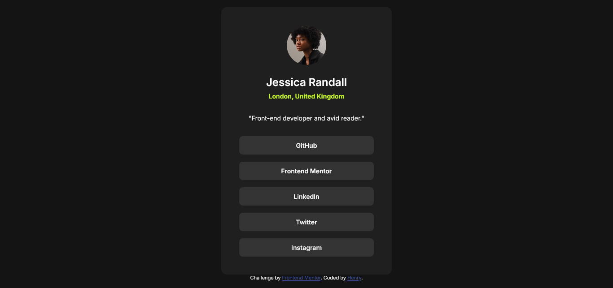

# Frontend Mentor - Social links profile solution

This is a solution to the [Social links profile challenge on Frontend Mentor](https://www.frontendmentor.io/challenges/social-links-profile-UG32l9m6dQ). 

## Table of contents

- [Overview](#overview)
  - [The challenge](#the-challenge)
  - [Screenshot](#screenshot)
  - [Links](#links)
- [My process](#my-process)
  - [Built with](#built-with)
  - [What I learned](#what-i-learned)
  - [Continued development](#continued-development)
  - [Useful resources](#useful-resources)
- [Author](#author)

## Overview

### The challenge

Users should be able to:

- See hover and focus states for all interactive elements on the page
- View the optimal layout for the component depending on their device's screen size (Mobile: 375px, Desktop: 1440px).

### Screenshot



### Links

- Solution URL: [https://github.com/Henrydevlab/social-links-profile](https://github.com/Henrydevlab/social-links-profile)
- Live Site URL: [https://henrydevlab.github.io/social-links-profile/](https://henrydevlab.github.io/social-links-profile/)

## My process

### Built with

- Semantic HTML5 markup
- CSS custom properties (Variables)
- Flexbox (for centering the card and arranging the buttons)
- Google Fonts: **Inter**
- Mobile-first workflow
- [Github Pages] - Deployment

### What I learned

Working on this challenge helped reinforce several key concepts, particularly accessibility and styling consistency:

```css
/* Implementing hover and focus states using smooth transitions */
.social-link-button:hover,
.social-link-button:focus {
  background-color: var(--color-green);
  color: var(--color-grey-900);
}

/* Ensuring accessibility for keyboard users */
.social-link-button:focus-visible {
  outline: 3px solid var(--color-green);
  outline-offset: 2px;
}
```
### Continued development

I plan to focus on the following areas in future projects:

- Refining the use of rem vs. em units for scalable typography and layout.

- Exploring how to implement the design using a utility-first CSS framework like Tailwind CSS for comparison.

- Increasing my speed in translating design specs (like padding and margin values) from a static image to CSS by practicing visual estimation.

### Useful resources

- [CSS-Tricks Guide to Pseudo-Classes](https://css-tricks.com/updated-flexbox-guide/) - Essential for mastering how to center the profile card and arrange the social links vertically.
- [MDN Web Docs: :focus-visible](https://developer.mozilla.org/en-US/docs/Web/CSS/Reference/Selectors/:focus-visible) - Crucial for implementing an accessible and user-friendly focus state, as required by the challenge

## Author

- Frontend Mentor - [@henrydevlab](https://www.frontendmentor.io/profile/henrydevlab)
- Twitter - [@henrydevlab](https://www.x.com/henrydevlab)